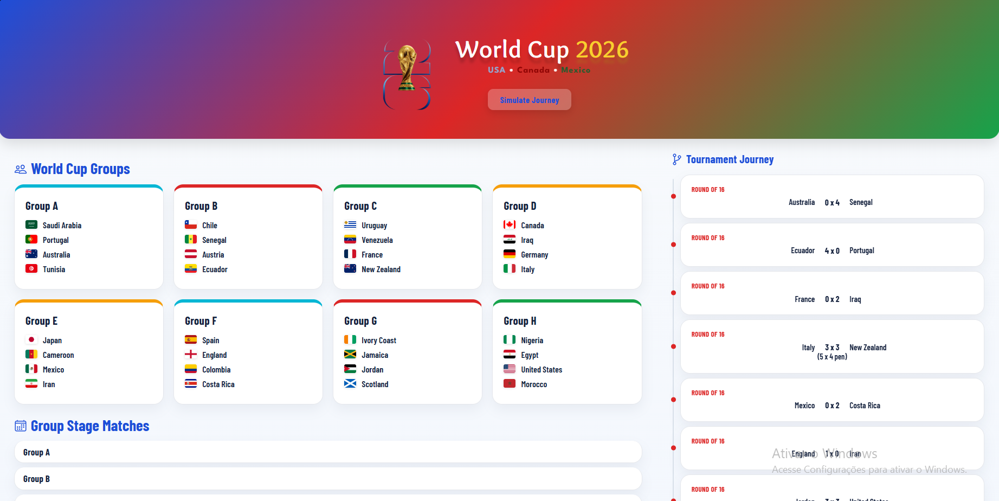
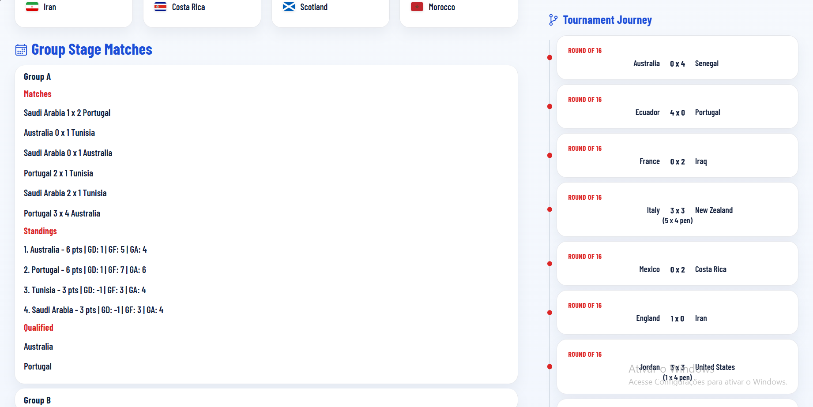
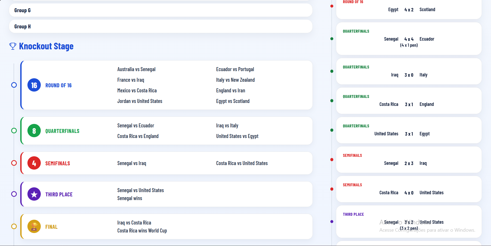
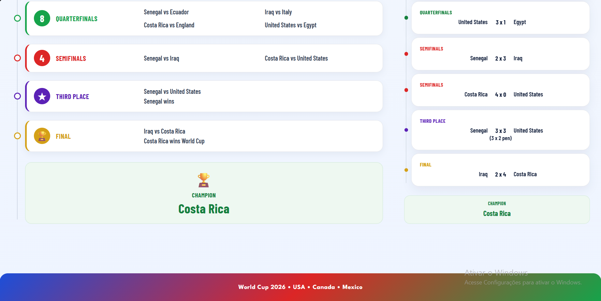

# World Cup 2026 Simulator

Simulation project developed as part of a technical challenge for an internship selection process.

The application consumes data from an external API, randomly distributes 32 national teams into 8 groups, simulates the group stage, knockout rounds, third-place match and final, and displays the full tournament journey visually.

## Features

- Fetches 32 teams from API
- Random group draw into 8 groups
- Group stage simulation with match results
- Points table and qualified teams
- Knockout stage simulation
- Penalty shootout in knockout ties
- Third-place match
- Final and champion display
- Final result submission to API

## Technologies

- HTML5
- CSS3
- JavaScript

## API Integration

The project uses the provided API endpoints for team retrieval and final result submission.

Due to CORS restrictions from the provided API, a temporary proxy may be required for full execution in browser environments.

## Live Preview

[View Project](https://diasalana.github.io/world-cup/)
## Project Preview

## About the Project

This project was built using only HTML, CSS and JavaScript, focusing on tournament logic, data organization and visual presentation.

Beyond meeting the technical requirements, I also worked on creating a clear interface to make the simulation easy to follow, from the group draw to the final champion.

## Author

Developed by **Alana Dias Pereira**.